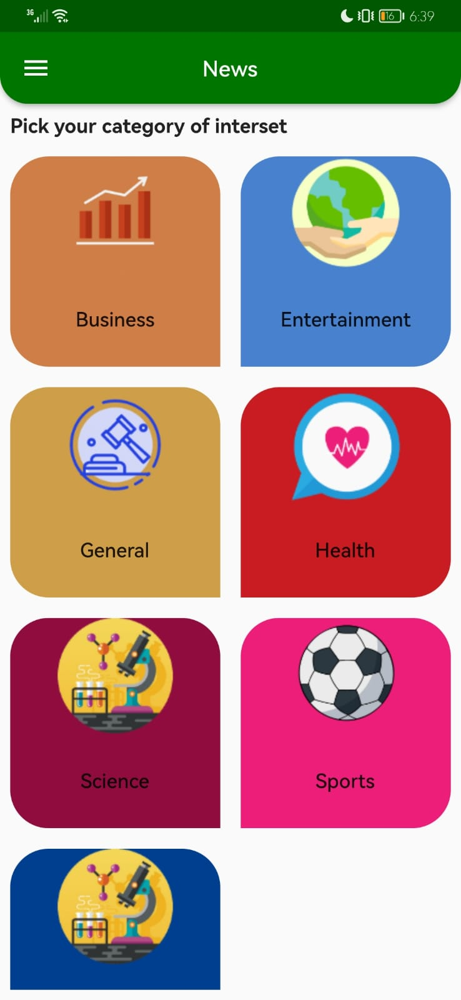
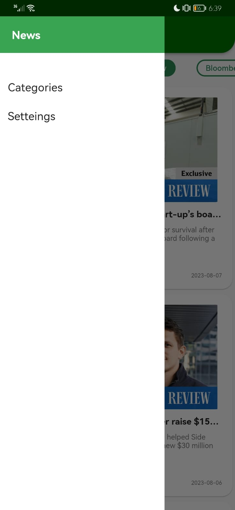

# Fresh Press News App 📰

Fresh Press is a Flutter-based news app that utilizes APIs to display up-to-date news articles and information. It is built using the BLoC (Business Logic Component) architecture pattern, which separates the business logic from the UI, making the application more scalable and maintainable.

## 🌟 Features

- Fetches news articles from various news APIs using HTTP client libraries.
- Parses the JSON responses to extract relevant content.
- Displays news articles in a clean and intuitive user interface.
- Provides search functionality to find specific news articles .
- Offers filtering options based on date range, category, or source.

## Project Structure

The project follows a modular structure to ensure separation of concerns and maintainability. Here's an overview of the main directories and their contents:

lib: Contains the main source code for the Fresh Press app.
data: Handles data fetching and parsing.
models: Defines the data models used in the app.
screens: Contains the UI screens for displaying news articles and search functionality.
bloc: Implements the BLoC pattern and contains the business logic components.
utils: Provides utility functions and helper classes.
widgets: Includes reusable UI components used throughout the app.

---

Thank you for using Fresh Press! We hope you find it useful and enjoy using the app to stay up-to-date with the latest news articles.

## 📸 Screenshots

Click to expand

### Category Screen

### News Screen

### News Screen

